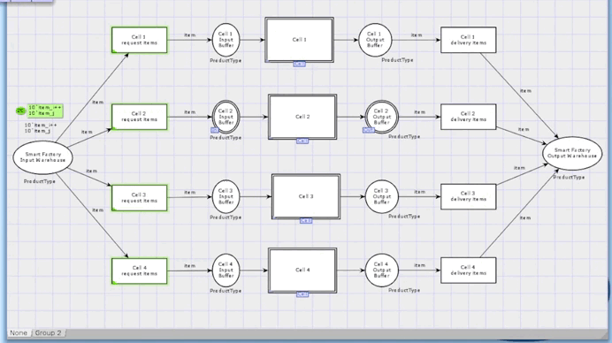

# 📦 Modelagem de Sistema de Manufatura com Redes de Petri Coloridas

Este projeto modela uma **fábrica com 4 células de manufatura** utilizando **Redes de Petri Coloridas (CPNs)** no ambiente **CPN Tools**. O objetivo é representar o fluxo de produtos, o comportamento dos robôs de transporte e o processamento dos produtos pelas máquinas, respeitando restrições como capacidade limitada de buffers e rotas específicas de produção.

## 🔧 Sobre o Sistema

A fábrica possui:
- Um **depósito de entrada geral** com produtos de dois tipos: `item_i` e `item_j`.
- **Quatro células de manufatura**, cada uma responsável por processar os produtos.
- Um **depósito de saída** onde os produtos finalizados são armazenados.

Cada célula de manufatura contém:
- Um **buffer de entrada e de saída**
- Três **máquinas** 
- Três **robôs** 

## 🎯 Objetivo da Modelagem

A modelagem visa:
- Controlar o fluxo de produtos pelas células.
- Garantir o processamento correto de cada tipo de produto conforme sua rota.
- Simular as restrições de capacidade e disponibilidade de recursos.

## 🧠 Abordagem de Modelagem

A modelagem utiliza:
- **Redes de Petri Coloridas (CPNs)**: para representar diferentes tipos de produtos e estados do sistema.
- **Hierarquia de páginas**: para modularizar o sistema em células, máquinas e sistema geral.
- **Tokens com cores**: representam produtos com tipos distintos (`item_i` e `item_j`).
- **Guards de transição** : definem as condições para ocorrência de transições do sistema.

## 🧩 Componentes do Sistema

### ✅ Produtos
- `item_i`: Produto do tipo I
- `item_j`: Produto do tipo J

### ✅ Robôs
- `Robô 1`: Leva produtos do buffer de entrada da célula até a máquina M1.
- `Robô 2`: Move produtos da saída de M1 para as máquinas M2 (para `item_i`) e M3 (para `item_j`).
- `Robô 3`: Leva produtos da saída de M2/M3 até o buffer de saída da célula.

Cada robô possui controle de disponibilidade modelado por tokens booleanos (`true` = disponível, `false` = ocupado).

### ✅ Máquinas
- **Máquina 1**: Processa ambos os tipos de produto (I e J).
- **Máquina 2**: Exclusiva para produtos do tipo `item_i`.
- **Máquina 3**: Exclusiva para produtos do tipo `item_j`.

Cada máquina possui:
- Um **buffer de entrada (capacidade: 4 itens)**
- Um **buffer de saída (capacidade: 4 itens)**
- Uma **transição de processamento** com tempo ou atraso representado.

### ✅ Células de Manufatura
Cada célula contém sua própria instância dos componentes acima, modelada como uma **subpágina hierárquica**.

## 📌 Comportamento do Sistema

1. **Requisição de produtos**:
   - A célula requisita um produto do depósito de entrada da fábrica, que envia um `item_i` ou `item_j` para seu buffer de entrada.

2. **Movimentação interna**:
   - Robôs controlam o transporte de produtos entre os buffers de entrada e saída das máquinas, respeitando disponibilidade..

3. **Processamento**:
   - Produtos seguem sua rota específica: M1 → M2 ou M1 → M3.
   - Após o processamento final, são enviados ao buffer de saída da célula e então para o depósito de saída da fábrica.

## 📁 Estrutura do Arquivo `smartfactory.cpn`

- `Smart Factory Page`: Conecta todas as células, depósito de entrada e de saída.
- `Cell Page`: Define os componentes de uma célula.
- `Machine Page`: Define o funcionamento de cada máquina (com buffers e transições de processamento).

## 🚀 Requisitos para Rodar

- [CPN Tools](https://cpntools.org/)

## Vídeo do Projeto

Tenha mais detalhes sobre o projeto com o [vídeo de explicação](https://drive.google.com/file/d/1Fq92dcAyffwg1yq9Lrnh6UqAtt3kXBVu/view?usp=sharing)

## 👨‍🔬 Autor

Este projeto foi desenvolvido por **Mateus Pincho**, como requisito avaliativo da disciplina Sistemas de Eventos Discretos, ministrada pelo Prof. Dr. Kyller Costa Gorgônio.

---

